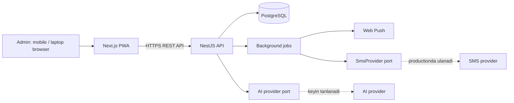
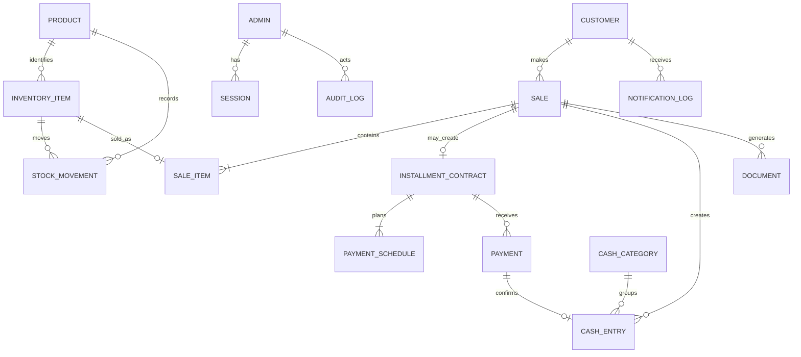

# Baraka Mobile CRM — Texnik arxitektura (v0.1)

## 1. Arxitektura maqsadi

CRM moliyaviy ma'lumotlar yo'qolmasligi, telefon va noutbukdan tez ishlashi, keyinchalik SMS hamda AI providerlarini xavfsiz almashtira olishi kerak. Shu sabab ilova modular monolith sifatida boshlanadi: deploy sodda, ma'lumotlar yagona PostgreSQL bazasida tranzaksion saqlanadi, lekin modullar keyinchalik mustaqil servisga ajralishga tayyor bo'ladi.



## 2. Monorepo tuzilmasi

`pnpm` workspace ishlatiladi. Frontend va backend bir repoda bo'ladi, lekin mustaqil build/deploy qilinadi.

```text
baraka-mobile-crm/
  apps/
    web/                 # Next.js, React, TypeScript, PWA
    api/                 # NestJS, TypeScript
  packages/
    contracts/           # API DTO/type'lari va umumiy enumlar
    eslint-config/       # umumiy lint qoidalari
    typescript-config/   # umumiy tsconfig
  infra/
    docker/              # Dockerfile va compose konfiguratsiyasi
  docs/
```

Frontend `apps/web`, backend `apps/api` ichida faqat o'z domain kodiga ega bo'ladi. `packages/contracts` faqat runtime biznes-logikani emas, API shakllari va enumlarni ulashadi; u frontendning backend ichki implementatsiyasiga bog'lanishini oldini oladi.

## 3. Texnologik qarorlar

| Qatlam | Tanlov | Sabab |
| --- | --- | --- |
| Runtime | Node.js LTS | talab qilingan, uzoq muddatli qo'llab-quvvatlash |
| Frontend | React, Next.js, TypeScript | responsive UI, PWA va server rendering imkoniyati |
| Backend | NestJS, TypeScript | aniq modul chegaralari, DI va testga qulaylik |
| Database | PostgreSQL | ACID tranzaksiyalar, ishonchli moliyaviy hisob |
| ORM | Prisma | type-safe so'rovlar, migratsiyalar va transaction API |
| API | REST + OpenAPI/Swagger | web mijoz va kelajakdagi integratsiyalar uchun aniq kontrakt |
| Background jobs | PostgreSQL-backed queue + NestJS worker | qarz eslatmalari va og'ir tahlillarni HTTP so'rovidan ajratish |
| Fayllar | S3-mos object storage | PDF va to'lov cheki fayllarini database'dan tashqarida saqlash |
| Push | Web Push + service worker | admin PWA uchun browser bildirishnomasi |
| SMS | `SmsProvider` adapteri | hozir test adapter, productionda provider adapteri |
| AI | `AiInsightsProvider` adapteri | model/providerga qaramlikni cheklash |

## 4. Backend modullari va chegaralari

| Modul | Javobgarlik |
| --- | --- |
| Auth | yagona admin logini, sessiya, parolni yangilash |
| Admin | admin profili va sozlamalari |
| Catalog | kategoriya, brend, mahsulot shablonlari |
| Inventory | seriyali birliklar, miqdorli qoldiq, ombor harakati |
| Customers | mijoz kartasi, telefon raqami dublikatlari |
| Sales | savdo drafti, tasdiqlash, qaytarish va chegirma |
| Installments | nasiya kelishuvlari va erkin/oylik jadval |
| Payments | qarzga qilingan to'lovlar, transferni tekshirish holati |
| Cashbook | kirim-chiqim, kategoriya va pul oqimi |
| Documents | qarz jadvali/PDF yaratish va faylga kirish |
| Reports | KPI, davr hisobotlari, eksportlar |
| Notifications | web push, SMS porti va yuborish tarixi |
| AiInsights | read-only ma'lumot tayyorlash va AI javoblari |
| Audit | o'zgarmas audit yozuvlari |

Modul boshqa modul jadvaliga bevosita yozmaydi. Masalan, `Sales` tasdiqlanganda domen event chiqaradi; `Inventory`, `Cashbook`, `Installments` va `Audit` kerakli yozuvlarni bitta database transaction ichida yaratadi. Bu ko'rinadigan natija yarim holatda qolmasligini ta'minlaydi.

## 5. Moliyaviy va ombor yaxlitligi

Moliyaviy ma'lumot uchun asosiy qoida: **tasdiqlangan operatsiya o'zgartirilmaydi va o'chirilmaydi**. Xato qaytarish yoki bekor qilish orqali teskari operatsiya bilan to'g'rilanadi.

### Savdo tasdiqlash transactioni

1. Tanlangan mahsulotlar mavjudligi va serial/IMEI takrorlanmasligi tekshiriladi.
2. Savdo, uning qatorlari va chegirma ma'lumoti yaratiladi.
3. Ombor birligi `SOLD` holatiga o'tadi yoki miqdor qoldig'i kamayadi.
4. Naqd to'lov bo'lsa, tasdiqlangan to'lov va `CASH_IN` yozuvi yaratiladi.
5. Nasiya bo'lsa, kelishuv hamda to'lov jadvali yaratiladi; boshlang'ich to'lov bo'lsa u ham yoziladi.
6. Audit yozuvi yaratiladi.

Yuqoridagi amallarning bari bitta PostgreSQL transactionida bajariladi. Bittasi xato bo'lsa, hech biri saqlanmaydi.

### To'lov holatlari

| Holat | Ma'nosi |
| --- | --- |
| `PENDING_VERIFICATION` | mijoz transfer qilganini bildirgan, admin hali tekshirmagan |
| `CONFIRMED` | pul qabul qilindi; qarz qoldig'i va cashbook hisobiga kiradi |
| `REJECTED` | chek/ma'lumot tasdiqlanmadi; moliyaviy hisobga kirmaydi |
| `REVERSED` | ilgari tasdiqlangan to'lov teskari yozuv bilan qaytarildi |

Naqd to'lov darhol `CONFIRMED` bo'ladi. Transfer bo'yicha mijozning Telegram orqali yuborgan cheki tashqarida ko'riladi, admin CRMda faylni biriktiradi va qo'lda tasdiqlaydi.

## 6. Ma'lumotlar modeli

Quyidagi model PostgreSQL jadval va foreign key'lar bilan ifodalanadi. Pul summalari `numeric(14, 2)` turida saqlanadi; JavaScript `float` hisoblar uchun ishlatilmaydi.



### Asosiy jadvallar

| Jadval | Muhim maydonlar |
| --- | --- |
| `admins` | `id`, `email`, `password_hash`, `display_name`, `theme` |
| `sessions` | `id`, `admin_id`, `token_hash`, `expires_at` |
| `products` | `id`, `category`, `brand`, `model`, `storage`, `color`, `is_serialized`, `default_sale_price` |
| `inventory_items` | `id`, `product_id`, `imei`, `serial_number`, `cost_price`, `status`, `received_at` |
| `stock_movements` | `id`, `inventory_item_id` yoki `product_id`, `type`, `quantity`, `reference_type`, `reference_id` |
| `customers` | `id`, `full_name`, `phone_e164`, `address`, `note` |
| `sales` | `id`, `customer_id`, `kind`, `status`, `subtotal`, `discount`, `total`, `sold_at` |
| `sale_items` | `id`, `sale_id`, `inventory_item_id`, `product_id`, `quantity`, `unit_price`, `cost_snapshot` |
| `installment_contracts` | `id`, `sale_id`, `principal`, `down_payment`, `outstanding_amount`, `status` |
| `payment_schedules` | `id`, `contract_id`, `due_date`, `amount_due`, `amount_paid`, `status` |
| `payments` | `id`, `contract_id`, `amount`, `method`, `status`, `paid_at`, `receipt_file_id` |
| `cash_entries` | `id`, `direction`, `amount`, `occurred_at`, `category_id`, `source_type`, `source_id`, `note` |
| `documents` | `id`, `type`, `storage_key`, `content_hash`, `created_at` |
| `notification_logs` | `id`, `channel`, `recipient`, `type`, `status`, `scheduled_for`, `sent_at` |
| `push_subscriptions` | `id`, `admin_id`, `endpoint`, `p256dh`, `auth` |
| `audit_logs` | `id`, `actor_id`, `action`, `entity_type`, `entity_id`, `before_json`, `after_json`, `created_at` |

`inventory_items.imei` va `inventory_items.serial_number` null bo'lmagan qiymatlar uchun unique bo'ladi. `customers.phone_e164` normalizatsiya qilinib unique qilinadi. Moliyaviy summalar snapshot sifatida `sale_items`da ham saqlanadi, shunda mahsulotning keyingi narxi eski savdo foydasini o'zgartirmaydi.

## 7. API va frontend chegarasi

API `/api/v1` prefiksi ostida REST endpointlar beradi. Muhim yo'nalishlar:

```text
POST   /auth/login
POST   /auth/logout
GET    /dashboard
GET    /products                 POST /products
GET    /inventory                POST /inventory/receive
GET    /customers                POST /customers
GET    /sales                    POST /sales
POST   /sales/:id/confirm        POST /sales/:id/reverse
POST   /installments/:id/schedule
POST   /payments                 POST /payments/:id/confirm
POST   /cash-entries
GET    /reports/summary
POST   /documents/installments/:id/pdf
POST   /push-subscriptions
GET    /ai-insights/daily
POST   /ai-insights/query
```

Next.js'da sahifalar domain bo'yicha ajratiladi: dashboard, sales, inventory, customers, installments, cashbook, reports, AI va settings. Form validatsiyasi clientda tezkor UX uchun, serverda esa majburiy qayta validatsiya uchun ishlatiladi. API'dan qaytgan xatolar foydalanuvchiga o'zbekcha va tushunarli xabar qilinadi.

Nasiya sahifasidagi `PDF saqlash` tugmasi `GET /documents/installments/:contractId/pdf` endpointidan dinamik PDF yuklaydi. Fayl faqat brauzerning download oqimida yaratiladi; printer yoki serverdagi doimiy file storage talab qilinmaydi.

## 8. PWA, push va SMS oqimi

Admin uchun Next.js service worker manifest bilan install qilinadigan PWA bo'ladi. Brauzer ruxsati berilgach, push subscription backendga saqlanadi.

Har kuni `REMINDER_HOUR` (default `09:00`, Toshkent vaqti) da va server ishga tushganda belgilangan ishchi jadval quyidagilarni bajaradi:

1. Ertaga muddati keladigan, hali to'liq to'lanmagan `payment_schedules`larni topadi.
2. Har schedule uchun `notification_logs`da shu turdagi xabar mavjudligini tekshiradi va atomik `PROCESSING` holati bilan uni faqat bitta worker oladi (idempotency).
3. Adminga web push yuboradi.
4. Mijoz telefoniga `SmsProvider.sendDueReminder()` orqali SMS yuboradi.
5. Natijani `SENT`, `FAILED`, `PENDING` yoki `PROCESSING` holatida saqlaydi; 10 daqiqadan ortiq turib qolgan ishlov qayta uriniladi.

Developmentda `SmsProvider`ning `ConsoleSmsProvider` varianti xabarni logga yozadi. Productionda provider tanlangach, faqat yangi adapter qo'shiladi; biznes logikasi o'zgarmaydi. API keylar repoga hech qachon kiritilmaydi, faqat production environment secret sifatida saqlanadi.

Brauzer push oqimi `PushSubscription`ni admin sessiyasi bilan saqlaydi. `PUSH_PROVIDER=webpush` uchun VAPID subject, public key va private key production secretlarda beriladi; Next.js buildiga faqat `NEXT_PUBLIC_VAPID_PUBLIC_KEY` qo'yiladi. Muddati tugagan subscriptionlar yuborishdan keyin avtomatik o'chiriladi.

## 9. AI tahlili xavfsizligi

AI provideriga bevosita database ulanishi berilmaydi. `AiInsights` moduli avval kerakli davr bo'yicha agregatlarni o'zi hisoblaydi, so'ng faqat shu cheklangan JSON kontekstini providerga yuboradi. AI:

- faqat o'qish va izohlash huquqiga ega;
- savdo, qarz, to'lov yoki ombor yozuvini yarata/yangilay/o'chira olmaydi;
- raqamli xulosada vaqt oralig'i va manba metrikaning nomini qaytaradi;
- provider xatosida UI'ni buzmaydi, oddiy hisobot ko'rsatishda davom etadi.

Foydalanuvchi savollari va AI javoblari audit uchun saqlanishi mumkin; shaxsiy ma'lumotlar imkon qadar AI kontekstidan chiqariladi. AI providerini yakuniy tanlash productiondan oldingi xavfsizlik va xarajat baholashidan keyin qilinadi.

## 10. Xavfsizlik va ishga tayyorlik

- Admin paroli Argon2id bilan hash qilinadi.
- Sessiya `HttpOnly`, `Secure`, `SameSite` cookie orqali yuritiladi; CSRF himoyasi qo'llanadi.
- DTO validatsiyasi va endpoint rate limiting mavjud bo'ladi.
- Object storage fayllari public emas; faqat vaqtinchalik, autentifikatsiyalangan URL orqali ochiladi.
- HTTPS majburiy; secretlar `.env` fayllari va deploy secret store'da saqlanadi.
- Har kuni PostgreSQL backup olinadi; restore jarayoni productiondan oldin sinovdan o'tadi.
- Structured log, error tracking, health endpoint va database connection monitoring ishlatiladi.
- Unit testlar business calculationlar uchun, integration testlar transaction oqimlari uchun, E2E testlar esa login/savdo/nasiya/to'lov asosiy yo'li uchun yoziladi.

## 11. Kodlash tartibi

1. Monorepo, lint/format/test, Docker va PostgreSQL local muhiti.
2. Auth, design system, dark/light theme, responsive shell va dashboard skeleton.
3. Catalog va Inventory; IMEI uniqueness hamda qabul oqimi.
4. Customers, Sales, Installments va Payments transactionlari.
5. Cashbook, Reports, audit, PDF va fayl biriktirish.
6. PWA, admin web push hamda SMS test adapteri.
7. AI Insights read-only moduli.
8. Production hardening, backup, CI/CD va haqiqiy SMS provider adapteri.
