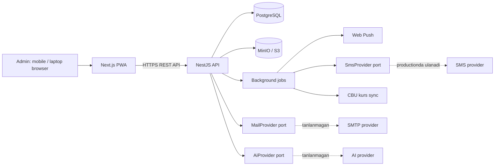
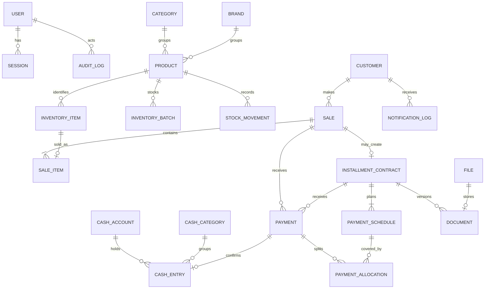

# HisobAI CRM — Texnik arxitektura (v0.2.1)

> **v0.2 haqida.** `DECISIONS.md` (2026-08-05/06) qarorlari asosida qayta
> yozilgan. Eng katta o'zgarish — **ko'p valyuta** tizimi: u deyarli har bir
> moliyaviy jadvalga tegadi, shuning uchun keyinroq qo'shilmaydi, boshidan
> quriladi. Ziddiyat chiqsa **`DECISIONS.md` ustun turadi**.
>
> **v0.2.1 (2026-08-09).** Audit natijasida 14 ta noaniqlik (`DECISIONS.md`
> §16) va 18 ta blocker (§17) yopildi. Asosiy tuzatishlar: savdo raqami
> tasdiqlashda ajratiladi, kassaga pul faqat to'lov orqali tushadi, qaytarish
> modeli bir manbali qilindi, ombor poygasi mexanizmi belgilandi,
> idempotency va DB cheklovlari qo'shildi.
>
> Yondosh hujjatlar: **`API.md`** (kesuvchi konventsiyalar),
> **`PERMISSIONS.md`** (ruxsat matritsasi), **`GLOSSARY.md`** (atamalar).

## 1. Arxitektura maqsadi

CRM moliyaviy ma'lumotlar yo'qolmasligi, telefon va noutbukdan tez ishlashi,
keyinchalik SMS, SMTP hamda AI providerlarini xavfsiz almashtira olishi kerak.
Shu sabab ilova **modular monolith** sifatida boshlanadi: deploy sodda,
ma'lumotlar yagona PostgreSQL bazasida tranzaksion saqlanadi, lekin modullar
keyinchalik mustaqil servisga ajralishga tayyor bo'ladi.



## 2. Monorepo tuzilmasi

`pnpm` workspace. Frontend va backend bir repoda, lekin mustaqil build/deploy.

```text
HisobAi/
  apps/
    web/                 # Next.js, React, TypeScript, PWA
    api/                 # NestJS, TypeScript, Prisma
  packages/
    contracts/           # API DTO/type'lari va umumiy enumlar
    typescript-config/   # umumiy tsconfig
    eslint-config/       # umumiy lint qoidalari
  infra/
    docker/              # production Dockerfile va compose
  docs/
```

`packages/contracts` faqat API shakllari va enumlarni ulashadi — runtime
biznes-logika emas. U frontendning backend ichki implementatsiyasiga
bog'lanishini oldini oladi.

## 3. Texnologik qarorlar

| Qatlam          | Tanlov                                                | Sabab                                               |
| --------------- | ----------------------------------------------------- | --------------------------------------------------- |
| Runtime         | Node.js LTS                                           | uzoq muddatli qo'llab-quvvatlash                    |
| Frontend        | React, Next.js, TypeScript                            | responsive UI, PWA va server rendering              |
| Backend         | NestJS, TypeScript                                    | aniq modul chegaralari, DI, testga qulaylik         |
| Database        | PostgreSQL                                            | ACID tranzaksiyalar, ishonchli moliyaviy hisob      |
| ORM             | Prisma                                                | type-safe so'rovlar, migratsiyalar, transaction API |
| API             | REST + OpenAPI/Swagger                                | aniq kontrakt                                       |
| Background jobs | PostgreSQL-backed queue + NestJS worker               | eslatma va kurs sync'ini HTTP so'rovidan ajratish   |
| Fayllar         | **MinIO** (S3-mos), `StorageProvider` adapteri ortida | §0.2 — Docker'siz, binary sifatida o'rnatiladi      |
| Dev muhiti      | **Lokal PostgreSQL**                                  | §0.3 — Docker image faqat production uchun          |
| Push            | Web Push + service worker                             | admin PWA bildirishnomasi                           |
| SMS             | `SmsProvider` adapteri                                | hozir console, productionda provider                |
| Email           | `MailProvider` adapteri                               | parol tiklash; provider tanlanmagan (§2.5)          |
| AI              | `AiProvider` adapteri                                 | model/providerga qaramlikni cheklash                |
| Kurs            | `ExchangeRateProvider` adapteri                       | CBU API; ishlamasa oxirgi ma'lum kurs               |

## 4. Pul va valyutani ifodalash

Bu bo'lim butun tizimga tegadi — undan chetga chiqilmaydi.

| Qoida            | Ifodasi                                                                                                                                                                      |
| ---------------- | ---------------------------------------------------------------------------------------------------------------------------------------------------------------------------- |
| Valyuta          | `Currency` enum: `UZS`, `USD`. Bazaviy valyuta — `UZS` (§1.1)                                                                                                                |
| Summa            | `numeric(18, 2)`. JavaScript `float` **hech qachon** pul hisobida ishlatilmaydi — Prisma `Decimal`                                                                           |
| Kurs             | `numeric(12, 4)` — 1 USD necha UZS                                                                                                                                           |
| Yaxlitlash       | USD 2 kasr xona, UZS butun songacha (§1.10). Yaxlitlash **yozishdan oldin** qilinadi, ko'rsatishda emas                                                                      |
| Yaxlitlash usuli | `Decimal` bilan `ROUND_HALF_UP` (§17.14). `Number()` + `toFixed()` **ishlatilmaydi** — u float xatosini kiritadi va taqsimot yig'indisi jadval summasiga teng bo'lmay qoladi |
| JSON'da pul      | **String** (`"12500000.00"`), hech qachon `number` — `API.md` §2.1                                                                                                           |
| Juftlik qoidasi  | Har bir pul ustuni **o'z valyuta ustuni bilan** yuradi. Valyutasiz summa ustuni bo'lmaydi                                                                                    |
| Snapshot qoidasi | Konvertatsiya bo'lgan har joyda **kurs snapshot** ustuni saqlanadi va qayta hisoblanmaydi (§1.7)                                                                             |

Amaliy natijalar:

- Savdo bitta valyutada (§1.9). Boshqa valyutadagi mahsulot savatga
  qo'shilganda **savdo kursida** aylantiriladi va `sale_items` ichida
  aylantirilgan narx bilan yoziladi.
- Qarz shartnoma valyutasida qoladi (§1.3). To'lov boshqa valyutada kelsa,
  `payments` ichida uchalasi saqlanadi: berilgan summa + valyutasi, o'sha
  paytdagi kurs, qarzdan ayrilgan summa + qarz valyutasi (§10.5).
- Qaytarish asl savdoning kursida (§1.8, §8.1) — `sales.exchange_rate`
  teskari yozuvga ko'chiriladi, joriy kurs olinmaydi.
- Ombor qiymati **bugungi** do'kon kursida baholanadi (§5.9), foyda esa savdo
  paytidagi snapshot kursda qoladi — o'tgan davr hisoboti o'zgarmaydi.

## 5. Backend modullari

| Modul           | Javobgarlik                                                       |
| --------------- | ----------------------------------------------------------------- |
| `Platform`      | SUPERADMIN login va sessiyasi, SHOP_ADMIN accountlari, status (§14.3) |
| `Auth`          | login, sessiya, urinishlar cheklovi va jurnali, parol tiklash     |
| `Users`         | foydalanuvchi profili, rol (MVP'da bitta biznes rol faol)         |
| `Shops`         | Shop yaratish (§25.6), do'kon sozlamalari va standart qiymatlar (§21.4) |
| `ExchangeRates` | CBU sync (09:00 Toshkent), do'kon kursi, kurs tarixi (§14.6)      |
| `Catalog`       | kategoriya, brend, mahsulot shablonlari                           |
| `Inventory`     | seriyali birliklar, partiyalar, ombor harakati, inventarizatsiya  |
| `Customers`     | mijoz kartasi, telefon normalizatsiyasi va dublikatlari, passport |
| `Sales`         | savdo qoralamasi, tasdiqlash, qaytarish va bekor qilish           |
| `Installments`  | nasiya shartnomalari, ustama, to'lov jadvali                      |
| `Payments`      | to'lovlar, taqsimlash, tasdiqlash/rad etish/qaytarish             |
| `Cashbook`      | kassa hisoblari, kirim-chiqim, valyuta ayirboshlash               |
| `Documents`     | shartnoma PDF versiyalari                                         |
| `Storage`       | MinIO adapteri, vaqtinchalik havolalar                            |
| `Reports`       | KPI, davr hisobotlari, dashboard                                  |
| `Notifications` | web push, SMS porti, yuborish tarixi                              |
| `AiInsights`    | read-only ma'lumot tayyorlash va AI javoblari                     |
| `Audit`         | o'zgarmas audit yozuvlari                                         |

`Settings` moduli `Shops` ga qo'shildi (§21.4): sozlamalar endi alohida
jadval emas, `shops` qatorining ustunlari.

**Modul boshqa modul jadvaliga bevosita yozmaydi.** Savdo tasdiqlanganda
`Sales` domen event chiqaradi; `Inventory`, `Cashbook`, `Installments` va
`Audit` kerakli yozuvlarni **bitta database transaction ichida** yaratadi.
Bu ko'rinadigan natija yarim holatda qolmasligini ta'minlaydi.

## 6. Moliyaviy va ombor yaxlitligi

Asosiy qoida: **tasdiqlangan operatsiya o'zgartirilmaydi va o'chirilmaydi.**
Xato qaytarish yoki bekor qilish orqali teskari operatsiya bilan to'g'rilanadi.

### Savdo tasdiqlash tranzaksiyasi

Kirish sharti: `Idempotency-Key` sarlavhasi (§17.6). Savdo allaqachon
`DRAFT` holatda mavjud — tranzaksiya uni **yangilaydi**, yangi qator
yaratmaydi (§17.1).

1. **Ombor shartli yangilash bilan band qilinadi** (§17.5 — bu §5.5 dagi
   "birinchi tasdiqlagan oladi" ning aniq mexanizmi):
   ```sql
   UPDATE inventory_items SET status = 'SOLD'
    WHERE id = $1 AND status = 'AVAILABLE';          -- rowCount = 0 → xato

   UPDATE inventory_batches SET quantity_remaining = quantity_remaining - $n
    WHERE id = $1 AND quantity_remaining >= $n;      -- rowCount = 0 → xato
   ```
   `SELECT` keyin `UPDATE` naqshi ishlatilmaydi — u `READ COMMITTED` da
   ikki tranzaksiyaga bir birlikni sotishga ruxsat beradi.
2. Savdo raqami `sale_counters` dan ajratiladi (§7.6, §17.1):
   `UPDATE sale_counters SET last_seq = last_seq + 1 WHERE year = $1 RETURNING last_seq`.
3. `sales` yangilanadi va `sale_items` qat'iylashtiriladi — **kurs snapshot**
   (savdo sanasidagi do'kon kursi, §17.11), **tannarx snapshot**,
   **tavsiya narx snapshot** bilan.
4. `stock_movements` yoziladi.
5. Savatdagi to'lovlar uchun `payments` yaratiladi: naqd va karta — darhol
   `CONFIRMED`, o'tkazma — `PENDING_VERIFICATION` (§17.2).
   `kind = CASH` savdoda to'lovlar yig'indisi `sales.total` ga teng bo'lishi
   tekshiriladi (§17.10).
6. **Faqat `CONFIRMED` to'lovlar uchun** `cash_entries` kirimi yaratiladi —
   `source_type = PAYMENT`, valyutasi bo'yicha tegishli hisobga (§11.1).
   Savdo kassaga **to'g'ridan-to'g'ri yozmaydi** (§17.2).
7. Nasiya bo'lsa: shartnoma + to'lov jadvali; jadval summasi qarzga teng
   ekani tekshiriladi (§9.6), yaxlitlash qoldig'i oxirgi qatorga (§17.15).
8. `audit_logs` yozuvi.

Bittasi xato bersa — hech biri saqlanmaydi.

### To'lov taqsimlash

To'lov **eng eski to'lanmagan jadval qatoridan boshlab** taqsimlanadi (§10.1);
har taqsimot `payment_allocations`da alohida qator bo'ladi. Bu qaytarishni
aniq teskari bajarish imkonini beradi.

`applied_amount = min(round(paid_amount / rate, scale), outstanding)`.
Ortiqcha to'lov **kiritilmaydi** (§10.2, §16.11): API `PAYMENT_EXCEEDS_OUTSTANDING`
qaytaradi, UI esa summa maydonini qarz qoldig'i bilan cheklaydi. Ortiqcha
naqd pul mijozga qaytim sifatida qaytariladi va tizimda yozuv yaratmaydi —
aks holda u kassada qolgan mijoz puli, ya'ni taqiqlangan "mijoz balansi"
bo'lardi.

Qoldiq shartnoma valyutasining eng kichik birligidan kam bo'lsa
(< 0.01 USD / < 1 UZS) oxirgi jadval qatori avtomatik `PAID` bo'ladi (§16.11).

### Qaytarish va bekor qilish

Teskari yozuv — **alohida `sales` qatori** va **yagona haqiqat manbai**
(§17.4): `reverses_sale_id` to'ldiriladi, `status = REVERSAL`, `total`
manfiy, `number` = asl raqam + `-R1` / `-R2`.

- Asl savdodagi `sale_items.returned_quantity` va
  `PARTIALLY_RETURNED` / `RETURNED` statuslari — **hosila kesh**; ular
  faqat shu tranzaksiya ichida yangilanadi.
- **Qaytarish** o'z sanasiga yoziladi (§8.7); mahsulot `RETURNED` holatda
  qaytadi va keyin "Sotuvga qaytarish" bilan `AVAILABLE` bo'ladi, sabab
  saqlanib qoladi (§16.4).
- **Bekor qilish** asl savdo sanasiga yoziladi va faqat oxirgi 7 kun
  ichidagi savdolarga qo'llanadi (§16.5); mahsulot to'g'ridan-to'g'ri
  `AVAILABLE` bo'ladi.
- Nasiya qaytarilsa/bekor qilinsa shartnoma `CANCELLED` bo'ladi (§17.18).
  Qisman qaytarishda qarz §16.12 formulasi bo'yicha kamayadi va faqat
  `UNPAID` jadval qatorlaridan, oxirgisidan boshlab ayriladi.

### Muddati o'tganlik

`payment_schedules.status` faqat `TOLANMAGAN` · `QISMAN` · `TOLANGAN`
bo'ladi. **"Muddati o'tgan" saqlanmaydi** — `due_date < bugun` va qarz
qolgan holatdan hisoblanadi (§9.8). Saqlansa uni yangilab turadigan jarayon
kerak bo'lardi va u ishlamay qolsa holat yolg'on ko'rsatardi.

## 7. Ma'lumotlar modeli



### Auth va foydalanuvchilar

| Jadval                  | Muhim maydonlar                                                                                               |
| ----------------------- | ------------------------------------------------------------------------------------------------------------- |
| `users`                 | `id`, `email` (unique), `password_hash` (Argon2id), `display_name`, `role`, `theme`, `is_active`              |
| `sessions`              | `id`, `user_id`, `token_hash`, `user_agent`, `ip`, `last_seen_at`, `expires_at`, `revoked_at` — 30 kun (§2.7) |
| `login_attempts`        | `id`, `email`, `ip`, `success`, `user_agent`, `created_at` — 5/15daq blok va jurnal (§2.9, §2.10)             |
| `password_reset_tokens` | `id`, `user_id`, `token_hash`, `expires_at`, `used_at` (§2.5)                                                 |

### Sozlamalar va kurs

| Jadval           | Muhim maydonlar                                                                                                                                                                                                                                                                                                                                       |
| ---------------- | ----------------------------------------------------------------------------------------------------------------------------------------------------------------------------------------------------------------------------------------------------------------------------------------------------------------------------------------------------- |
| `shops`               | Shop boshiga bitta qator (§21.4): `name`, `logo_file_id`, `address`, `phone`, `work_start`, `work_end`, `weekend_days`, `low_stock_threshold`, `default_installment_months`, `default_down_payment_percent`, **`store_rate_markup_percent`** (§16.2), `reminder_hour`. `base_currency` **yo'q** — bazaviy valyuta doim `UZS` (§1.1, §17.18) |
| `cbu_rates`           | `date` (unique), `rate`, `fetched_at` — platforma darajasida (§21.5)                                                                                                                                                                                                                                                                       |
| `shop_exchange_rates` | `(shop_id, date)` unique, `store_rate`, `source` (`CBU`/`MANUAL`), `updated_by_id` (§3.5, §14.6)                                                                                                                                                                                                                                           |

### Katalog

| Jadval       | Muhim maydonlar                                                                                                                                                                                                                            |
| ------------ | ------------------------------------------------------------------------------------------------------------------------------------------------------------------------------------------------------------------------------------------ |
| `categories` | `id`, `name` (normalizatsiyalangan, unique), `is_active`                                                                                                                                                                                   |
| `brands`     | `id`, `name` (normalizatsiyalangan, unique), `is_active`                                                                                                                                                                                   |
| `products`   | `id`, `category_id`, `brand_id`, `model`, `storage`, `color`, `display_name` (avtomatik, §4.6), `type` (`SERIALIZED`/`QUANTITY`), `currency`, `suggested_price`, `low_stock_threshold`, `description`, `image_file_id`, `is_active` (§4.8) |

### Ombor

| Jadval              | Muhim maydonlar                                                                                                                                  |
| ------------------- | ------------------------------------------------------------------------------------------------------------------------------------------------ |
| `inventory_items`   | `id`, `product_id`, `imei_1`, `imei_2`, `serial_number`, `cost_price`, `cost_currency`, `status`, `received_at`, `return_reason`, `note`         |
| `inventory_batches` | `id`, `product_id`, `quantity_received`, `quantity_remaining`, `unit_cost`, `cost_currency`, `received_at`, `note` (§5.2)                        |
| `stock_movements`   | `id`, `product_id`, `inventory_item_id?`, `batch_id?`, `type`, `quantity`, `reason`, `reference_type`, `reference_id`, `occurred_at`, `actor_id` |
| `stocktakes`        | `id`, `status`, `started_at`, `completed_at`, `actor_id`, `note` (§5.6)                                                                          |
| `stocktake_lines`   | `id`, `stocktake_id`, `product_id`, `inventory_item_id?`, `expected_quantity`, `counted_quantity`, `reason` (§5.7)                               |

`imei_1`, `imei_2` va `serial_number` null bo'lmagan qiymatlar uchun unique;
IMEI qidiruvi ikkala ustunni ham qamraydi (§5.3).

### Mijozlar

| Jadval      | Muhim maydonlar                                                                                                                                                                                       |
| ----------- | ----------------------------------------------------------------------------------------------------------------------------------------------------------------------------------------------------- |
| `customers` | `id`, `full_name`, `phone_primary` (E.164, unique), `phone_secondary`, `address`, `note`, `passport_series`, `passport_number`, `pinfl`, `passport_file_id`, `is_flagged`, `flag_reason`, `is_active` |

Qarz ustuni **yo'q** — qarz faqat tranzaksiyalardan hisoblanadi (§6.12) va
valyuta bo'yicha alohida ko'rsatiladi (§6.11).

### Savdo

| Jadval          | Muhim maydonlar                                                                                                                                                                                                                                                                                                                 |
| --------------- | ------------------------------------------------------------------------------------------------------------------------------------------------------------------------------------------------------------------------------------------------------------------------------------------------------------------------------- |
| `sales`         | `id`, **`number?`** (`2026-00147`, unique — qoralamada `null`, §17.1), `customer_id?`, `kind`, `status` (`DRAFT`/`CONFIRMED`/`PARTIALLY_RETURNED`/`RETURNED`/`CANCELLED`/`REVERSAL`), `currency`, `exchange_rate`, `total`, `sold_at`, `confirmed_at`, `created_by_id`, `reverses_sale_id?`, `reversal_kind`, `reversal_reason` |
| `sale_items`    | `id`, `sale_id`, `product_id`, `inventory_item_id?`, `batch_id?`, `quantity`, `unit_price` (**naqd narx, ustamasiz** — §17.3), `cost_snapshot`, `cost_currency`, `suggested_price_snapshot`, `returned_quantity` (kesh, §17.4)                                                                                                  |
| `sale_counters` | `year` (PK), `last_seq` — savdo raqamini poygasiz ajratish uchun (§17.1)                                                                                                                                                                                                                                                        |

Tannarx va tavsiya narx `sale_items`da snapshot sifatida saqlanadi — keyingi
narx o'zgarishi eski savdo foydasini o'zgartirmaydi (§7.4, §7.11).

`subtotal` ustuni **olib tashlandi** (§17.18): chegirma maydoni yo'q (§7.3),
soliq va yetkazib berish scope'da yo'q — u doim `total` ga teng edi.

### Nasiya

| Jadval                  | Muhim maydonlar                                                                                                                                                                        |
| ----------------------- | -------------------------------------------------------------------------------------------------------------------------------------------------------------------------------------- |
| `installment_contracts` | `id`, `sale_id` (unique), `currency`, `cash_price`, `markup_amount`, `markup_percent`, `principal`, `down_payment`, `status` (`ACTIVE`/`CLOSED`/`CANCELLED`), `closed_at` (§9.3, §9.7) |
| `payment_schedules`     | `id`, `contract_id`, `sequence`, `due_date`, `amount_due`, `amount_paid`, `status` (`UNPAID`/`PARTIAL`/`PAID`)                                                                         |

`outstanding_amount` **saqlanmaydi** — jadval va taqsimotlardan hisoblanadi
(§6.12 bilan bir mantiq: hisoblanadigan qiymat ikki joyda turmasin).

### To'lovlar

| Jadval                | Muhim maydonlar                                                                                                                                                                                                                                                           |
| --------------------- | ------------------------------------------------------------------------------------------------------------------------------------------------------------------------------------------------------------------------------------------------------------------------- |
| `payments`            | `id`, `sale_id?`, `contract_id?`, `paid_amount`, `paid_currency`, `exchange_rate`, `applied_amount`, `applied_currency`, `method`, `status`, `paid_at`, `confirmed_at`, `rejected_reason`, `receipt_file_id?`, `cash_account_id`, `created_by_id`, `reverses_payment_id?` |
| `payment_allocations` | `id`, `payment_id`, `schedule_id`, `amount` (§10.1)                                                                                                                                                                                                                       |

`sale_id` ham, `contract_id` ham bo'lishi — v0.1 dagi arxitektura xatosining
tuzatilishi (§7.2): ilgari faqat `contract_id` bor edi, naqd savdo to'lovini
yozadigan joy yo'q edi.

### Kassa

| Jadval            | Muhim maydonlar                                                                                                                                                                                      |
| ----------------- | ---------------------------------------------------------------------------------------------------------------------------------------------------------------------------------------------------- |
| `cash_accounts`   | `id`, `name`, `currency`, `kind` (`CASH`/`BANK`/`CARD`), `is_active`, `sort_order` (§11.1)                                                                                                           |
| `cash_categories` | `id`, `name`, `direction`, `is_system`, `is_active` (§11.10)                                                                                                                                         |
| `cash_entries`    | `id`, `account_id`, `direction` (`IN`/`OUT`), `amount`, `currency`, `occurred_at`, `category_id?`, `source_type`, `source_id?`, `note`, `attachment_file_id?`, `created_by_id`, `reverses_entry_id?` |
| `cash_exchanges`  | `id`, `from_account_id`, `to_account_id`, `from_amount`, `to_amount`, `rate`, `occurred_at`, `note` (§11.6)                                                                                          |

`source_type`: `PAYMENT` · `MANUAL` · `OPENING_BALANCE` · `EXCHANGE` ·
`REVERSAL`. `MANUAL` bo'lmagan yozuv qo'lda tahrirlanmaydi (§11.7);
`MANUAL` yozuv faqat o'sha kuni ichida tahrirlanadi/o'chiriladi (§11.8).
Boshlang'ich qoldiq va ayirboshlash daromad deb sanalmaydi (§11.4, §11.6).

**`SALE` va `PERSONAL_USE` olib tashlandi:**

- `SALE` — kassaga pul faqat `Payment` orqali tushadi (§17.2), aks holda
  bir pul ikki yo'ldan yozilib, ikki marta sanalishi mumkin edi.
  `cash_entries.sale_id` ustuni ham keraksiz — bog'lanish
  `cash_entry → payment → sale` orqali.
- `PERSONAL_USE` — shaxsiy foydalanishda kassadan pul chiqmaydi (§17.12).
  U pul bo'lmagan xarajat: `stock_movements(PERSONAL_USE)` yoziladi va
  hisobotda tannarx miqdorida alohida xarajat satri bo'ladi. Kassa yozuvi
  yaratilsa, qoldiq jismoniy naqd puldan farq qilib qolardi — bu §11.3 da
  nomlangan muammoning aynan o'zi.

### Fayllar, hujjatlar, bildirishnomalar, audit

| Jadval               | Muhim maydonlar                                                                                                                              |
| -------------------- | -------------------------------------------------------------------------------------------------------------------------------------------- |
| `files`              | `id`, `storage_key`, `original_name`, `mime_type`, `size_bytes`, `kind`, `uploaded_by_id` — maks 10 MB, siqilmaydi (§15.7)                   |
| `documents`          | `id`, `type`, `contract_id`, `version`, `file_id`, `content_hash` — har qayta tuzishda yangi versiya (§15.3)                                 |
| `notification_logs`  | `id`, `channel`, `type`, `recipient`, `schedule_id?`, `customer_id?`, `status`, `scheduled_for`, `sent_at`, `processing_started_at`, `error` |
| `push_subscriptions` | `id`, `user_id`, `endpoint` (unique), `p256dh`, `auth`, `last_used_at`                                                                       |
| `audit_logs`         | `id`, `actor_id`, `action`, `entity_type`, `entity_id`, `before_json`, `after_json`, `ip`, `created_at`                                      |
| `idempotency_keys`   | `key` (PK), `user_id`, `endpoint`, `request_hash`, `status_code`, `response_body`, `created_at` — 24 soat saqlanadi (§17.6, `API.md` §4)     |

Passport rasmini kim ko'rgani ham `audit_logs`ga yoziladi (§6.7).

`notification_logs` unique kaliti — `(schedule_id, channel, type, scheduled_for)`
(§17.13). `scheduled_for` kalitga kiritilmasa, jadval qatori qayta
rejalashtirilganda (§9.10) yangi sana uchun eslatma hech qachon
yuborilmaydi.

### Ma'lumot yaxlitligi cheklovlari

Baza darajasidagi `CHECK` cheklovlari — **kod xatosidan himoyaning oxirgi
qatlami** (§17.8). To'liq ro'yxat `proposals/v0.2.1-migration.sql` da:
valyuta mosligi (`cash_entries` ↔ hisob, tannarx ↔ mahsulot), manfiy
bo'lmagan partiya qoldig'i, `returned_quantity ≤ quantity`, to'lovda
`sale_id` yoki `contract_id` bo'lishi, musbat summalar, `principal`
formulasi, holat izchilligi, boshlang'ich qoldiqning hisob uchun bir marta
bo'lishi.

Barcha vaqt ustunlari — `timestamptz` (§17.9). "Bugun" doim
`Asia/Tashkent` da hisoblanadi; `@db.Date` maydonlar kalendar sana
sifatida qoladi.

## 8. API

`/api/v1` prefiksi ostida REST. **Kesuvchi konventsiyalar — `API.md`da:**
xato formati va kodlari, pagination, filtr, saralash, idempotency,
rate limiting, fayl validatsiyasi, pul va sana serializatsiyasi.

```text
POST   /auth/login            POST /auth/logout          GET  /auth/me
POST   /auth/forgot-password  POST /auth/reset-password
POST   /auth/change-password
GET    /auth/sessions         DELETE /auth/sessions/:id  DELETE /auth/sessions
GET    /auth/login-attempts

POST   /platform/auth/login   POST /platform/auth/logout   GET /platform/auth/me
GET    /platform/shop-admins  POST /platform/shop-admins
GET    /platform/shop-admins/:id       PATCH /platform/shop-admins/:id/status

POST   /shops                 GET  /shops/me               PATCH /shops/me
GET    /exchange-rates        GET  /exchange-rates/today   PUT /exchange-rates/:date
POST   /exchange-rates/sync                 # §18.4 — CBU'dan hozir olish
POST   /exchange-rates/:date/reset-to-cbu   # §16.8 — MANUAL dan qaytish

GET    /categories            POST /categories             PATCH /categories/:id
POST   /categories/:id/merge
GET    /brands                POST /brands                 PATCH /brands/:id
POST   /brands/:id/merge
GET    /products              POST /products               PATCH /products/:id
GET    /products/:id

GET    /inventory             POST /inventory/receive      GET  /inventory/:id
GET    /inventory/batches     GET  /inventory/movements    # partiya qoldiqlari (§5.2)
POST   /inventory/adjust      POST /inventory/personal-use
POST   /inventory/:id/restock                            # §16.4 sotuvga qaytarish
GET    /stocktakes            POST /stocktakes             GET  /stocktakes/:id
POST   /stocktakes/:id/complete   POST /stocktakes/:id/cancel

GET    /customers             POST /customers              PATCH /customers/:id
GET    /customers/:id         GET  /customers/:id/history

GET    /sales                 POST /sales                  GET  /sales/:id
PATCH  /sales/:id             DELETE /sales/:id            # faqat qoralama
POST   /sales/:id/confirm     POST /sales/:id/return       POST /sales/:id/cancel

GET    /installments          GET  /installments/:id
PATCH  /installments/:id/schedule   POST /installments/:id/close

GET    /payments              GET  /payments/:id           POST /payments
POST   /payments/:id/confirm  POST /payments/:id/reject    POST /payments/:id/reverse

GET    /cash-accounts         POST /cash-accounts          PATCH /cash-accounts/:id
GET    /cash-categories       POST /cash-categories
GET    /cash-entries          POST /cash-entries
PATCH  /cash-entries/:id      DELETE /cash-entries/:id     # §11.8 o'sha kuni
GET    /cashbook/balances     POST /cashbook/exchange

GET    /dashboard
GET    /reports/summary       /reports/sales   /reports/profit
GET    /reports/debts         /reports/inventory  /reports/top-products

GET    /audit-logs
POST   /documents/contracts/:id/pdf
POST   /files                 GET  /files/:id            # 15 daqiqalik havola
POST   /push-subscriptions    DELETE /push-subscriptions/:id
GET    /ai-insights/daily     POST /ai-insights/query
GET    /health/live           GET  /health/ready
```

`POST /sales/:id/reverse` **yo'q** — qaytarish va bekor qilish biznes
ma'nosi jihatidan boshqa amallar (§8), API ham shuni aks ettiradi (§17.18).

`/settings` `/shops/me` ga ko'chdi (§21.4). `shopId` so'rovda uzatilmaydi
— backend uni sessiyadan oladi (§25.13, §14.4).

Next.js sahifalari domain bo'yicha ajratiladi: `/login`, `/dashboard`,
`/sales`, `/inventory`, `/customers`, `/installments`, `/payments`,
`/cashbook`, `/reports`, `/insights`, `/settings`, `/setup-shop` —
hamda ulardan butunlay ajratilgan `/superadmin/*` guruhi (§14.7).

Form validatsiyasi clientda tezkor UX uchun, **serverda esa majburiy qayta
validatsiya** uchun. API xatolari foydalanuvchiga o'zbekcha va tushunarli
qilib ko'rsatiladi.

## 9. Fayl saqlash (MinIO)

`StorageProvider` porti ortida MinIO (S3-mos) turadi (§0.2). Development
muhitida Docker yo'q — MinIO binary sifatida o'rnatiladi.

- Fayllar **hech qachon ochiq havolada bo'lmaydi**; API 15 daqiqalik
  imzolangan havola beradi (§15.5).
- Maksimal hajm 10 MB, avtomatik siqish yo'q (§15.7).
- Shartnoma PDF'i saqlanadi va versiyalanadi (§15.2, §15.3) — mijozga
  berilgan nusxa bilan aynan bir xil qoladi.

## 10. Fon jarayonlari

| Jarayon          | Vaqti                                                              | Vazifa                                                                                     |
| ---------------- | ------------------------------------------------------------------ | ------------------------------------------------------------------------------------------ |
| CBU kurs sync    | har kuni 09:00 (Toshkent)                                          | CBU kursini olib `cbu_rates`ga yozish, so'ng **har Shop uchun** do'kon kursini o'z ustamasi bilan hisoblab `shop_exchange_rates`ga yozish (§3.3, §14.6). `MANUAL` qatorlar chetlab o'tiladi (§16.8) |
| To'lov eslatmasi | har kuni `reminder_hour` (default 09:00) va server ishga tushganda | ertaga muddati keladigan to'lanmagan qatorlar                                              |

Eslatma oqimi:

1. Ertaga muddati keladigan, to'liq to'lanmagan `payment_schedules` topiladi.
2. Dam olish kuni bo'lsa yuborilmaydi (§3.7).
3. Har schedule uchun `notification_logs`da shu turdagi xabar borligi
   tekshiriladi va atomik `PROCESSING` holati bilan uni **faqat bitta worker**
   oladi (idempotency).
4. Adminga web push (§18).
5. Mijoz telefoniga `SmsProvider.sendDueReminder()`.
6. Natija `SENT` / `FAILED` / `PENDING` / `PROCESSING` sifatida saqlanadi;
   10 daqiqadan ortiq turib qolgan ishlov qayta uriniladi.

Kurs olinmasa ilova to'xtamaydi — oxirgi ma'lum kurs ishlatiladi va UI'da
"kurs eskirgan" ogohlantirishi chiqadi (§1.5, §3.4).

## 11. AI tahlili xavfsizligi

AI provideriga bevosita database ulanishi berilmaydi. `AiInsights` moduli
avval kerakli davr bo'yicha agregatlarni **o'zi hisoblaydi**, so'ng faqat shu
cheklangan JSON kontekstini providerga yuboradi. AI:

- faqat o'qish va izohlash huquqiga ega;
- savdo, qarz, to'lov yoki ombor yozuvini yarata/yangilay/o'chira olmaydi;
- raqamli xulosada vaqt oralig'i va manba metrikaning nomini qaytaradi;
- provider xatosida UI'ni buzmaydi — oddiy hisobot ko'rsatishda davom etadi.

Shaxsiy ma'lumotlar (passport, telefon) imkon qadar AI kontekstidan
chiqariladi. Provider yakuniy tanlovi productiondan oldingi xavfsizlik va
xarajat baholashidan keyin qilinadi.

## 12. Xavfsizlik va ishga tayyorlik

- Parol Argon2id bilan hash qilinadi (§2.4).
- Sessiya `HttpOnly`, `Secure`, `SameSite=Strict` cookie orqali; CSRF —
  double-submit token (§2.8, `API.md` §1).
- Login urinishlari cheklanadi va jurnalga yoziladi (§2.9, §2.10).
  Reverse proxy ortida `trust proxy` **sozlanadi** — aks holda IP bo'yicha
  cheklov yagona foydalanuvchini bloklaydi.
- DTO validatsiyasi `whitelist: true, forbidNonWhitelisted: true` bilan —
  mass assignment'ga qarshi. `cost_snapshot`, `exchange_rate`, `number`,
  `status` clientdan **hech qachon** qabul qilinmaydi.
- **Idempotency** barcha moliyaviy `POST` uchun majburiy (§17.6).
- Ruxsat: global **default DENY** guard, `@Roles()` dekoratori,
  rolga bog'liq javob serializatsiyasi — `PERMISSIONS.md`.
- **Tenant izolyatsiyasi** — Prisma extension'da majburiy shop konteksti
  (§14.4); kontekstsiz so'rov xato beradi, bo'sh filtr bilan ketmaydi.
  Raw SQL alohida ko'rib chiqiladi (§21.8). `shopId` **hech qachon**
  clientdan qabul qilinmaydi (§25.12) — `exchange_rate` va `cost_snapshot`
  bilan bir xil qoida.
- Rate limiting endpoint sinflari bo'yicha — `API.md` §6.
- Object storage fayllari public emas — faqat vaqtinchalik havola (§15.5);
  yuklashda MIME oq ro'yxati, fayl imzosi va EXIF tozalash (`API.md` §7).
- `audit_logs` ilova DB roli uchun faqat `INSERT`/`SELECT` — `UPDATE` va
  `DELETE` rad etiladi, "o'zgarmas audit" e'lon emas, kafolat bo'lsin.
- HTTPS majburiy; secretlar `.env` va deploy secret store'da. **API kalitlari
  repoga hech qachon kiritilmaydi.**
- **Hosting O'zbekiston hududida** — passport va JSHSHIR shaxsga doir
  ma'lumot (§16.13).
- PostgreSQL backup: kunlik to'liq nusxa + WAL arxivlash (PITR).
  Maqsad: RPO ≤ 5 daqiqa, RTO ≤ 1 soat. **Restore jadval bo'yicha sinaladi** —
  sinalmagan backup backup emas.
- Structured log, error tracking, health endpointlari (`/health/live`,
  `/health/ready`), DB connection monitoring. Alert: CBU sync ketma-ket
  ikki kun ishlamasa, eslatma jarayoni turib qolsa.
- Build artifaktlari (`.js`, `.d.ts`, `*.tsbuildinfo`) git'ga kirmaydi —
  `.gitignore` buni ta'minlaydi.

### Testlar

| Daraja      | Qamrov                                                                                                 |
| ----------- | ------------------------------------------------------------------------------------------------------ |
| Unit        | pul va valyuta hisoblari, yaxlitlash, to'lov taqsimoti, jadval tuzish, foyda hisobi                    |
| Integration | savdo tasdiqlash tranzaksiyasi, qaytarish/bekor qilish, to'lov tasdiqlash va qaytarish, ombor tuzatish |
| **Tenant**  | **cross-Shop IDOR** — har bir shop-scoped resurs uchun parametrlangan (§25.11); kontekstsiz so'rov xato berishi; SUPERADMIN biznes endpointda 403 |
| E2E         | login → savdo → nasiya → to'lov asosiy yo'li                                                           |

Savdo tasdiqlash va to'lov taqsimlash — eng xavfli ikki joy: noto'g'ri
ishlasa pul hisobi buziladi va buni hech kim sezmaydi. Ular testsiz
`main`ga kirmaydi.

Tenant testi ham shu ro'yxatga qo'shiladi va u **namuna emas,
parametrlangan** bo'lishi shart: har bir shop-scoped resurs uchun
avtomatik ishlasin, aks holda keyin qo'shilgan resurs testsiz qoladi.
Qo'shimcha to'siq — CI'da ishlaydigan skript: §14.5 ro'yxatidagi har bir
modelda `shop_id` borligini tekshiradi.

## 13. Kodlash tartibi

`TZ.md` §22 bilan bir xil (v0.2.1 da qayta tuzilgan, §17.17):

0. **Qarorlarni yopish:** hujjat ziddiyatlari, `API.md`/`GLOSSARY.md`/
   `PERMISSIONS.md`, schema tuzatishlari va cheklovlar migratsiyasi.
1. **Kesuvchi poydevor:** exception filter va xato formati, zod
   validatsiya pipe'i (`.strict()` — whitelist), idempotency interceptor,
   pagination yordamchisi, `Decimal` ↔ JSON serializatsiyasi, **audit
   servisi** (tranzaksiya ichida — §6, quyidagi izohga qarang), optimistik
   qulf (`API.md` §8), `@Roles` guard (default DENY), rate limiting va
   `Retry-After`, `trust proxy`.

   > Audit **interceptor bilan bajarilmaydi**: §6 uni asosiy o'zgarish
   > bilan bitta tranzaksiyada talab qiladi, interceptor esa undan
   > tashqarida ishlaydi — amal saqlanib, audit yozilmay qolishi mumkin
   > bo'lardi. Shu sabab `AuditService.record(tx, …)`.

**MVP-1**

2. Auth va sozlamalar (users/role, sessiya, login cheklovi, parol
   o'zgartirish, do'kon sozlamalari, valyuta kursi va CBU sync).
3. Catalog va Inventory (kategoriya/brend + merge, mahsulot, seriyali birlik
   va partiya, qabul qilish).
4. Customers.
5. **Sales (naqd) + Cashbook** — tasdiqlash tranzaksiyasi, `payments`,
   kassa hisoblari va yozuvlari, dashboard.

**Platforma (§21.1)**

6. **Platform va tenant izolyatsiyasi** — `platform_admins`, `shops`,
   barcha biznes jadvallariga `shop_id`, avtomatik shop konteksti
   (§14.4), kurs modelining bo'linishi (§14.6), cross-Shop testlari.

**MVP-2**

7. Sales reversal — qaytarish va bekor qilish.
8. Installments va Payments — jadval, taqsimot, tasdiqlash, erta yopish.
9. Reports va audit ko'rinishi.
10. Documents (shartnoma PDF) va Storage.

**Kengaytirish**

11. Inventarizatsiya, shaxsiy foydalanish, valyuta ayirboshlash.
12. PWA, web push, SMS test adapteri.
13. AI Insights read-only moduli.
14. Production hardening, backup/restore sinovi, CI/CD, haqiqiy SMS va SMTP.

**Nega 0 va 1 bosqichlar birinchi:** hujjat ziddiyatini kod yozilmaganda
tuzatish arzon; kesuvchi konventsiyalarni keyin qo'shish esa har bir
modulni qayta ko'rib chiqishni talab qiladi.

**Nega naqd savdo nasiyadan ajratilgan:** savdo, qaytarish, nasiya va
to'lov — to'rtta murakkab tranzaksion mantiq. Ularni bir vaqtda yozish
va bir vaqtda debug qilish loyihaning eng katta xavfi. MVP-1 tugaganda
do'kon allaqachon ishlaydi va tizim real ma'lumot bilan sinaladi.

**Nega tenant qatlami MVP-2 dan oldin (§21.1):** aynan o'sha to'rtta
modul hali yozilmagan. Ular avval single-tenant yozilsa, keyin har bir
tranzaksiya, hisobot so'rovi va `CHECK` cheklovi qayta ko'rib chiqiladi.
Hozir real ma'lumot yo'q va backfill migratsiyasi arzon; 6-bosqichdan
keyin yozilgan har bir yangi so'rov esa avtomatik shop-scoped bo'ladi
(§14.4) va dasturchi buni unutib qo'yolmaydi.

## 14. Multi-tenant (SaaS) arxitektura

### 14.1. Maqsad

HisobAI bir nechta mustaqil Shop'larni bitta platformada ishlatadigan SaaS architecture asosida quriladi.

Har bir Shop alohida tenant hisoblanadi.

Tenant boundary backend va database access layer orqali majburiy enforce qilinadi.

Architecture quyidagi asosiy talabni kafolatlashi kerak:

> Shop A business data'si Shop B business data'siga hech qachon aralashmasligi kerak.

---

### 14.2. Platform hierarchy

```text
HisobAI Platform
│
├── SUPERADMIN
│     │
│     └── Platform account administration
│
├── SHOP_ADMIN A
│     │
│     └── SHOP A
│           ├── Settings
│           ├── Catalog
│           ├── Inventory
│           ├── Customers
│           ├── Sales
│           ├── Installments
│           ├── Payments
│           ├── Cashbook
│           ├── Reports
│           └── AI
│
└── SHOP_ADMIN B
      │
      └── SHOP B
            ├── Settings
            ├── Catalog
            ├── Inventory
            ├── Customers
            ├── Sales
            ├── Installments
            ├── Payments
            ├── Cashbook
            ├── Reports
            └── AI
```

---

### 14.3. Platforma va biznes hisoblari ajratilgan (§21.3)

`SUPERADMIN` **`users` jadvalida emas** — u `platform_admins` da,
o'z sessiya jadvali va o'z cookie'si bilan.

| Qatlam            | Biznes (`SHOP_ADMIN`)         | Platforma (`SUPERADMIN`)        |
| ----------------- | ----------------------------- | ------------------------------- |
| Jadval            | `users`                       | `platform_admins`               |
| Sessiya           | `sessions`                    | `platform_sessions`             |
| Cookie            | `SESSION_COOKIE_NAME`         | `PLATFORM_SESSION_COOKIE_NAME`  |
| Guard             | `SessionGuard` + `RolesGuard` | `PlatformSessionGuard`          |
| Dekorator         | `@Roles(...)`                 | `@PlatformOnly()`               |
| Shop konteksti    | `user.shopId` dan             | **yo'q**                        |

Sabab: §25.20 SUPERADMIN'ning tenant data'ga kira olmasligini
**invariant** deb e'lon qiladi. Bitta jadval va `role` bilan bu invariant
har so'rovdagi `if` ga tayanardi. Alohida jadvalda SUPERADMIN'da `shopId`
umuman yo'q — shop-scoped so'rov u uchun texnik jihatdan bajarilmaydi
(§14.4). Kod tekshiruviga emas, **strukturaga** tayangan kafolat.

`@Roles()` va `@PlatformOnly()` bitta endpointda ishlatilmaydi; ikkalasi
ham qo'yilmagan endpoint — default DENY (`PERMISSIONS.md` §1).

---

### 14.4. Shop konteksti majburiy va avtomatik (§21.7)

Servis kodida qo'lda `where: { shopId }` **yozilmaydi**. Sabab: 93 ta
API faylida har bir so'rovga filtr qo'shish — kafolat emas, intizom, va
bitta unutilgan joy §25.11 dagi cross-Shop IDOR'ni beradi.

Chegara **ikki qatlamda** majburlanadi (§21.13): Prisma extension
ergonomikani beradi, PostgreSQL RLS esa kafolatni.

```text
request → ShopContextMiddleware      (user.shopId dan, hech qachon
   │                                  query/header'dan — §25.12)
   ↓
AsyncLocalStorage<{ shopId }>
   ↓
PrismaService.$extends({ query: { $allOperations } })
   │   kontekst yo'q            → SHOP_CONTEXT_MISSING (bazaga bormaydi)
   │   tranzaksiya yo'q         → shaffof tranzaksiyaga o'raydi (§21.15)
   ↓
SELECT set_config('app.current_shop_id', $1, true)     (§21.14)
   ↓
PostgreSQL RLS (ENABLE + FORCE, USING va WITH CHECK bilan):
  shop_id = NULLIF(current_setting('app.current_shop_id', true), '')::uuid
```

`NULLIF` majburiy (§21.17): `set_config(…, true)` bir marta ishlagach,
tranzaksiya tugaganda maxsus parametr `NULL` ga emas, **bo'sh satrga**
qaytadi. Usiz bir xil xato yangi ulanishda jim bo'sh natija, ilgari
ishlatilgan ulanishda esa cast xatosi bo'lardi.

`WITH CHECK` ham `USING` bilan birga yoziladi: `USING` faqat qaysi
qatorlar **ko'rinishini** boshqaradi, yangi qatorga qanday `shop_id`
yozilishini emas. Faqat `USING` bo'lsa, boshqa tenant'ga qator
**yozib** yuborish mumkin bo'lardi.

**Nega ikkita qatlam.** Extension'ning o'zi yetarli emas edi: Prisma tip
tizimi `shopId` ni create inputida majburiy qilib qoldiradi va servis uni
qo'lda yozishga majbur bo'lardi — ya'ni "dasturchi unutib qo'yolmaydi"
degan maqsad bajarilmasdi. Maydonni ixtiyoriy qilishning yagona yo'li —
`@default(...)`. Default `current_setting(...)` bo'lgach, RLS qo'shish
deyarli tekinga tushdi va u §21.8 dagi raw SQL teshigini ham yopdi.

Uchta qoida bu qatlamni ishonchli qiladi:

1. **Kontekstsiz so'rov xato beradi**, bo'sh filtr bilan ketmaydi.
   "Filtr yo'q = hamma qator" — tenant tizimlarida ma'lumot sizishining
   eng ko'p uchraydigan sababi.
2. **Jim bo'sh natija ham xato hisoblanadi.** RLS yoqilgan holda
   o'zgaruvchi qo'yilmasa, siyosat hech bir qatorga mos kelmaydi va
   so'rov `[]` qaytaradi — xato emas. Bu xatodan battar, shuning uchun
   extension kontekst yo'qligini **o'zi** aniqlaydi va bazaga umuman
   bormaydi (§21.15).
3. Chiqish yo'li **aniq nomlangan** — `runWithoutShopScope()`, va uni
   faqat `Platform` moduli ishlatadi. Grep bilan topiladigan yagona joy.

`$transaction` ichida kontekst saqlanadi — `AsyncLocalStorage` buni
tabiiy qiladi, ya'ni §6 dagi savdo tasdiqlash tranzaksiyasi o'zgarmaydi;
unga faqat boshida bitta `set_config` qo'shiladi.

**Ilova cheklangan DB roli ostida ulanadi (§21.16).** RLS jadval egasi
va superuser uchun chetlab o'tiladi; `FORCE ROW LEVEL SECURITY` egani
qamraydi, lekin superuser baribir o'tadi. Shuning uchun `hisobai_app`
roli — ixtiyoriy yaxshilanish emas, RLS ishlashining sharti
(`PERMISSIONS.md` §4).

**Raw SQL extension'dan o'tmaydi (§21.8) — lekin RLS'dan o'tadi.**
§21.13 dan keyin bu joylar allaqachon himoyalangan: siyosat qatlami
so'rov qayerdan kelganini bilmaydi. Shunga qaramay `shop_id` sharti
**baribir aniq yoziladi** — himoya uchun emas, o'qilishi uchun: `WHERE
year = $1` ni o'qigan dasturchi u global hisoblagichni yangilayapti deb
o'ylaydi. Kod bazasida `$queryRaw` / `$executeRaw` **uchta** joyda
ishlatiladi va ro'yxat testda qotiriladi:

| Joy                                              | §     | Chora                                  |
| ------------------------------------------------ | ----- | -------------------------------------- |
| `sale_counters` raqam ajratish                   | 17.1  | `WHERE shop_id = … AND year = …`       |
| Mahsulot nomi advisory lock (`product.service`)  | 18.5  | Qulf kalitiga `shop_id` qo'shiladi     |
| `SELECT 1` (`health.controller`)                 | —     | Tenant jadvaliga tegmaydi, o'zgarmaydi |

Ombor shartli `UPDATE` (§17.5) bu ro'yxatda **yo'q**: u
`tx.inventoryItem.updateMany(...)` va `tx.inventoryBatch.updateMany(...)`
bilan yozilgan, ya'ni oddiy model metodi va extension uni qamraydi.

Alohida qatlam — **DB triggerlari**. Ular so'rov emas, shuning uchun
extension ham, qo'lda filtr ham ularga tegishli emas; ular migratsiyada
SQL darajasida qayta yoziladi:

| Trigger                              | §     | O'zgarish                              |
| ------------------------------------ | ----- | -------------------------------------- |
| IMEI ustunlararo unique tekshiruvi   | 18.3  | Solishtirish `shop_id` ichida bo'ladi  |
| `CHECK` cheklovlari                  | 17.8  | Yangi ustunlarni qamrashi tekshiriladi |

Advisory lock kalitiga `shop_id` qo'shilishi ikkala joyda ham majburiy:
usiz bitta Shop'da mahsulot qo'shish boshqa Shop'dagi qabulni kutib
turardi — mantiqiy xato emas, lekin tenant'lar bir-birini sekinlashtiradi.

---

### 14.5. Ma'lumotlar modeliga o'zgarishlar

**Yangi jadvallar**

| Jadval              | Muhim maydonlar                                                                                        |
| ------------------- | ------------------------------------------------------------------------------------------------------ |
| `platform_admins`   | `id`, `email` (unique), `password_hash`, `display_name`, `is_active`                                   |
| `platform_sessions` | `sessions` bilan bir xil shakl, `platform_admin_id` bilan                                              |
| `shops`             | `id`, `name`, `phone`, `address`, `logo_file_id` + **eski `settings` ning barcha maydonlari** (§21.4)  |
| `shop_admins` holati | `users.status` — `ACTIVE`/`SUSPENDED`/`DISABLED` (§21.6)                                              |

`settings` jadvali o'chiriladi — u `shops` ga aylanadi. `users` ga
`shop_id` (**nullable**, §21.10) va `@@unique([shop_id])` qo'shiladi:
1 SHOP_ADMIN = 1 SHOP (§25.7).

**`shop_id` qo'shiladigan jadvallar** (§25.10): `categories`, `brands`,
`products`, `inventory_items`, `inventory_batches`, `stock_movements`,
`stocktakes`, `stocktake_lines`, `customers`, `sales`, `sale_items`,
`sale_counters`, `installment_contracts`, `payment_schedules`,
`payments`, `payment_allocations`, `cash_accounts`, `cash_categories`,
`cash_entries`, `cash_exchanges`, `files`, `documents`,
`notification_logs`, `push_subscriptions`, `audit_logs`.

**`audit_logs.shop_id` — yagona NULLABLE istisno.** Qolgan hamma joyda
ustun `NOT NULL`. Sabab: §25.17 SUPERADMIN'ning account-level amallarini
(`SHOP_ADMIN_CREATED` va h.k.) audit qilishni talab qiladi, ular esa
hech qanday Shop'ga tegishli emas. Amaliy natijasi §14.4 uchun muhim:
shop-scoped so'rov platforma yozuvlarini **ko'rmaydi** (bu to'g'ri), lekin
`shop_id` siz yozilgan biznes audit yozuvi ham ko'rinmay qoladi — shuning
uchun `AuditService.record(tx, …)` da `shopId` majburiy argument bo'ladi
va faqat platforma yo'li uni `null` qoldiradi.

`push_subscriptions` §25.10 da sanalgan va ro'yxatga qo'shilgan: eslatma
jarayoni (§10) uni **schedule bo'yicha** topadi, ya'ni foydalanuvchi
orqali emas — Shop kontekstisiz bir tenant'ning to'lov eslatmasi
boshqasining qurilmasiga ketishi mumkin edi.

**`idempotency_keys` — alohida holat (§21.11).** U biznes jadvali emas,
lekin `response_body` ustunida **boshqa Shop'ning javobi** turadi.
Kalit `key` ustidagi global PK, va takrorlashda faqat `request_hash`
solishtiriladi — `user_id` tekshirilmaydi. Bu bir tenantli tizimda
xavfsiz edi. Yechim: unique `(shop_id, key)` ga o'tadi va takrorlash
yo'lida `user_id` mosligi ham tekshiriladi.

Bola jadvallarda (`sale_items`, `payment_allocations`, `stocktake_lines`)
`shop_id` denormalizatsiya qilinadi — u shop-scoped `@@unique` va
to'g'ridan-to'g'ri so'rov uchun kerak. Ota bilan mosligi kompozit FK
(`@@unique([id, shop_id])` ustiga) bilan kafolatlanadi, ya'ni bola
qatorining `shop_id` si otasinikidan farq qila olmaydi.

**Global unique → shop-scoped.** Bu ro'yxat to'liq bajarilishi shart:
aks holda ikkinchi Shop birinchisining ma'lumotini yozolmaydi.

| Hozir                                                | Bo'ladi                              |
| ---------------------------------------------------- | ------------------------------------ |
| `customers.phone_primary`                            | `(shop_id, phone_primary)` (§25.15)  |
| `categories.slug`, `brands.slug`, `cash_categories.slug` | `(shop_id, slug)`                |
| `inventory_items.imei_1` / `imei_2` / `serial_number` | shop-scoped partial unique + §18.3 triggeri `shop_id` bilan qayta yoziladi |
| `sales.number`                                       | `(shop_id, number)`                  |
| `sale_counters.year` (PK)                            | `(shop_id, year)` (§21.9)            |
| `cash_accounts (name, currency)`                     | `(shop_id, name, currency)`          |

`§21.9` muhim: umumiy hisoblagichda ikkinchi do'kon `2026-00001` dan
emas, birinchisi qayerda to'xtagan bo'lsa o'shandan boshlardi — ya'ni
mijozga ko'rinadigan raqam boshqa tenant'ning savdo hajmini oshkor
qilardi.

`docs/proposals/v0.2.1-migration.sql` dagi `CHECK` cheklovlari
migratsiyada takrorlanadi — aks holda "kod xatosidan himoyaning oxirgi
qatlami" (§17.8) yangi ustunlarni qamramaydi.

---

### 14.6. Kurs modeli ikkiga bo'linadi (§21.5)

| Jadval                 | Daraja    | Maydonlar                                                     |
| ---------------------- | --------- | ------------------------------------------------------------- |
| `cbu_rates`            | platforma | `date` (unique), `rate`, `fetched_at`                         |
| `shop_exchange_rates`  | Shop      | `(shop_id, date)` unique, `store_rate`, `source`, `updated_by_id` |

CBU kursi butun O'zbekiston uchun bitta — uni har Shop qatorida
takrorlash sync'ni N marta yozishga majbur qilardi. Do'kon kursi esa
aynan Shop'ga tegishli: §16.2 uni `store_rate_markup_percent` dan
hisoblaydi, u endi `shops` da.

`ExchangeRatesService` shunga mos ikkiga bo'linadi:

- **CBU sync** — fon jarayoni (§10), platforma darajasida bir marta;
- **Shop kursi** — §16.2 hisobi, §16.8 (`MANUAL` daxlsizligi),
  §16.6 (eskirganlik) va §17.11 (orqadagi sana) shop qatorida.

`POST /exchange-rates/sync` (§18.4) `cbu_rates` ni yangilaydi va
so'rovchi Shop'ning kursini qayta hisoblaydi.

---

### 14.7. API va sahifalar

Biznes marshrutlari **o'zgarmaydi** — `shopId` so'rovda uzatilmaydi
(§25.13), backend uni sessiyadan oladi. Qo'shiladiganlar:

```text
POST   /platform/auth/login    POST /platform/auth/logout
GET    /platform/auth/me
GET    /platform/shop-admins   POST /platform/shop-admins
GET    /platform/shop-admins/:id
PATCH  /platform/shop-admins/:id/status      # §21.6

POST   /shops                  # SHOP_ADMIN o'ziga Shop yaratadi (§25.6)
GET    /shops/me               PATCH /shops/me    # eski /settings
```

`GET /settings` va `PATCH /settings` `/shops/me` ga ko'chadi (§21.4).

Next.js: `/superadmin/*` — `(app)` va `(auth)` dan **butunlay ajratilgan**
route guruhi, o'z layout'i va o'z API klienti bilan (§25.4).
`/app/setup-shop` — §25.6 oqimi; `shopId` null bo'lsa `(app)` layout'i
shunga yo'naltiradi.

---

### 14.8. Xatolar

| Kod                   | Holat | Ma'nosi                                                        |
| --------------------- | ----- | -------------------------------------------------------------- |
| `SHOP_SETUP_REQUIRED` | 409   | Account bor, Shop yo'q — `/app/setup-shop` ga yo'naltiriladi (§21.10) |
| `SHOP_CONTEXT_MISSING`| 500   | Ichki xato: shop-scoped so'rov kontekstsiz bajarildi (§14.4)   |

Birinchisi ataylab 403 emas: Shop'siz account — **normal** holat (§25.5),
va 403 frontendga "ruxsat yo'q" deb tushuntirardi, u esa setup oqimiga
yo'naltira olmasdi.

Cross-Shop urinish (§25.11) alohida kod olmaydi — resurs **topilmaydi**
va 404 qaytadi. Sabab: 403 "bunday ID bor, lekin sizniki emas" degan
ma'lumotni oshkor qiladi.
